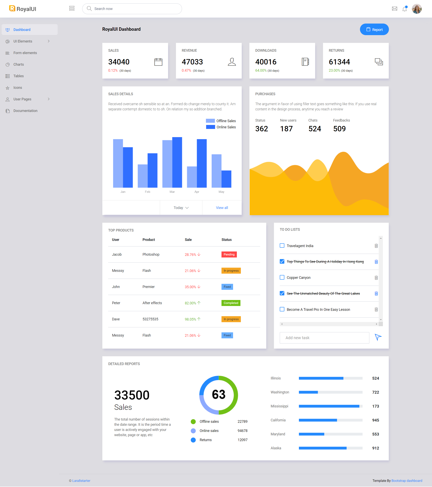
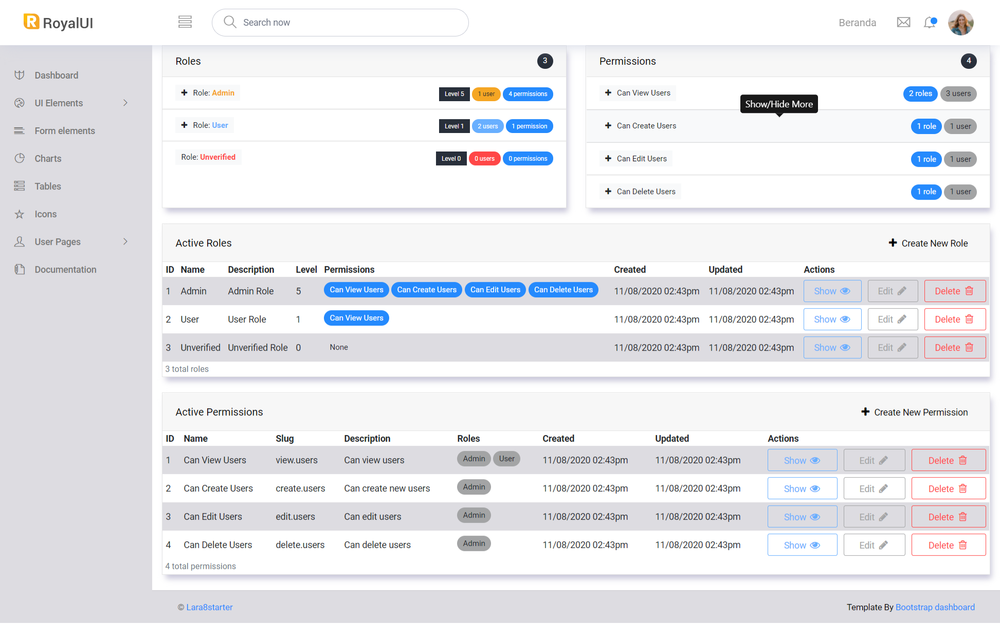
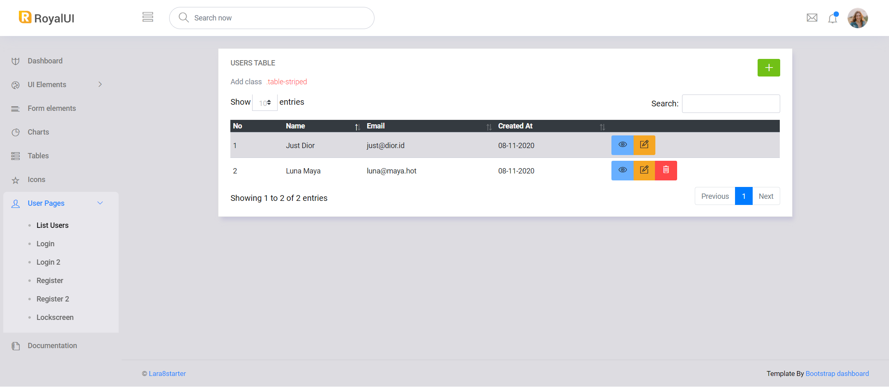

    <a href="https://laravel.com" target="_blank">v8.12</a>

# lara8starter

### Packages
- [jeremykenedy/laravel-roles](https://github.com/jeremykenedy/laravel-roles/tree/v4.0.0)
- [crestapps/laravel-code-generator](https://github.com/CrestApps/laravel-code-generator/tree/v2.4.4)
- [nwidart/laravel-modules](https://github.com/nWidart/laravel-modules/tree/8.0.0)
- [freshbitsweb/laratables](https://github.com/freshbitsweb/laratables/tree/v2.4.0)
- [livewire/livewire](https://github.com/livewire/livewire)

### Template
- [tabler/tabler](https://github.com/tabler/tabler/tree/v1.0.0-alpha.12)
<!-- 

 -->
